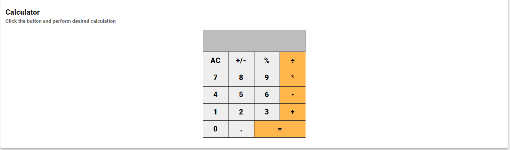
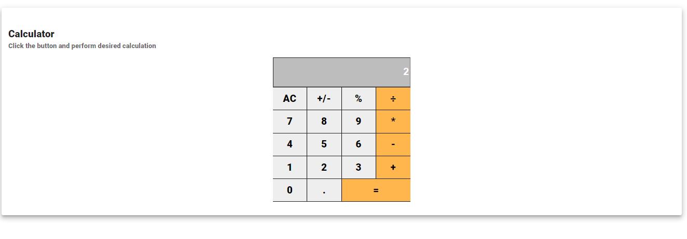

# TSX-Calculator

#### created using Typescript and MUI-core (formerly called Material-UI)

This is our most-used tool calculator with some new design and written using typescript in a NPM package which can be used in your react or Next.js application

## Getting Started

Install this package:

```shell
npm install tsx-calculator
```

Import the Counter component:

```js
import { Calculator } from "tsx-calculator";
```

You can then render the `Calculator` component like any other React component in JSX like below

```js
<Calculator />
```

### Types of operation

| Sign | Description                                                                                                                                   |
| ---- | --------------------------------------------------------------------------------------------------------------------------------------------- |
| +    | Addition                                                                                                                                      |
| -    | Substraction                                                                                                                                  |
| \*   | Multiplication                                                                                                                                |
| ÷    | Division                                                                                                                                      |
| %    | Percentage value of the last entered number. Eg. If we type 1 and then click this symbol, it will divide this number by 100 and give you 0.01 |
| =/-  | Negation of the last entered number. Eg. If we type 1 and then click this symbol, it will negate this number and give back -1                 |
| AC   | Clears all the values or operation                                                                                                            |
| .    | Decimal Point                                                                                                                                 |
| =    | Equal to sign                                                                                                                                 |

This component also follows the basic arithmetic operation. So, if you do 1 + -2, it will calculate 1-2 and return -1 and if you do 1 - -1, it will calculate 1 + 1 and will return 2

Some images to show how the application works




